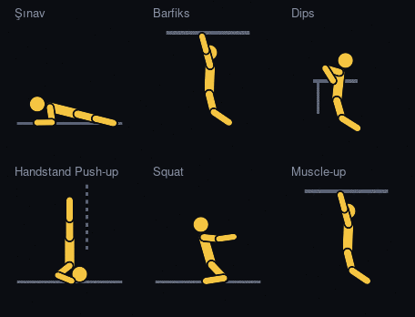
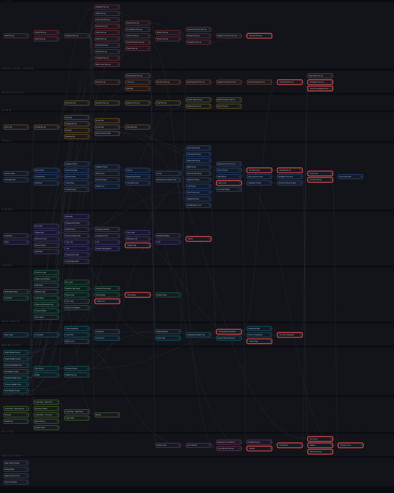
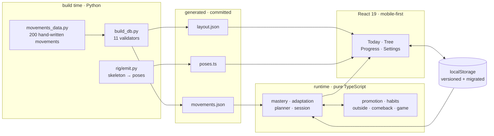

# Project Ascend

***English** · [Türkçe](README.tr.md)*

[](https://github.com/kuurtali/project-ascend/actions/workflows/deploy.yml)
[](LICENSE)


> A map for learning calisthenics — every movement is a skill node, you
> can't reach one without clearing its prerequisites, and the whole thing
> is laid out like an RPG progression tree.

**This is not a workout logger.** Loggers record the past; this system
shows the next step and adjusts it based on what you actually did.

**▶ Live: [kuurtali.github.io/project-ascend](https://kuurtali.github.io/project-ascend)**
Open it on a phone, "Add to Home Screen" — it behaves like an app and works
offline.

<p align="center">
  
</p>

<div align="center">

**[▶ Open the app](https://kuurtali.github.io/project-ascend)** ·
[Skill tree](#the-skill-tree) ·
[Adaptation rule](#the-adaptation-rule) ·
[Promotion gate](#the-promotion-gate--volume-then-consent) ·
[Consistency](#consistency-tracked-separately-from-capability) ·
[Architecture](#architecture) ·
[Decisions](docs/SECOND_BRAIN.md) ·
[Changelog](CHANGELOG.md) ·
[Roadmap](docs/SON_PLAN.md) ·
[Türkçe](README.tr.md)

</div>

---

## What's in here, technically

If you're reading this as an engineer rather than as someone who wants to
learn a handstand, this is the short version:

| | |
|---|---|
| **A validated DAG** | 200 movements, 239 prerequisite edges, max depth 11. Hand-written in Python, checked by 11 validators (cycles, orphans, unreachable bosses, non-monotonic thresholds, equipment cascade), emitted as JSON. CI regenerates it on every push and fails if the committed output drifts. |
| **A deterministic engine** | No LLM, no server, no network. Given `(movements, playerState)` it returns the next state or the next plan. Pure TypeScript, never touches the DOM, 157 tests. |
| **Generated figures** | 200 movements are drawn by 28 poses under forward kinematics. Poses are generated by a Python rig (`tools/rig/`) into TypeScript, so the preview tool and the app can't drift apart. Animated with SMIL — no JS loop, no battery cost. |
| **Local-first** | `localStorage`, versioned schema, forward-only migrations that never delete. One-tap export. A service worker that is deliberately network-first for HTML, after a cache-first version silently hid two releases. |
| **Decisions are the artifact** | 68 decision records with reasoning, including the wrong turns. `docs/SECOND_BRAIN.md`. |

---

## Why it exists

People almost never quit calisthenics because they lack the talent. It's
one of three things:

1. **Not knowing the order.** They want a planche and have never heard of
   a pseudo planche push-up.
2. **Not seeing progress.** Eight weeks took their push-up from 12 to 16 —
   a real gain — but nothing recorded it, so it never registered.
3. **Scale blindness.** A front lever is a two-year project. Someone who
   doesn't know that quits in month three.

All three are information and visibility problems, not training problems.

---

## The skill tree

200 movements, 239 prerequisite edges, 11 layers deep. Red-bordered nodes
are bosses — the targets at the end of each path.

<p align="center">
  
</p>

The tree isn't hand-drawn. It's generated from definitions in
`tools/movements_data.py`, validated by `build_db.py`, and laid out by
`make_layout.py`.

**And it's the working surface, not a picture.** Every node accepts reps
directly — enter a number, tap done, and it lands in the same log the
prescribed sessions write to. Every node also carries a thin bar showing
how much volume has accumulated on it, readable without opening anything.
When the bar fills, the node offers what it unlocks.

That last part is the whole progression model in one gesture: *do X of
this, then the next one is available.* The prescribed weekly session is
one way in; the tree is the other.

Starred movements sit in a strip above the canvas with their own progress
bars — in a 200-node graph the hard part isn't panning around, it's
finding the same five nodes every time. Tapping one flies the view to it.

---

## Core systems

### The adaptation rule

This is the reason the project exists. If the system says "do 12", you do
10, and the plan doesn't change, then it's no better than a list on the
internet.

| What happened | Next target |
|---|---|
| Hit the target, said **easy** | **+2** |
| Hit the target, normal or hard | **+1** |
| Missed by 1-2 | **same number** — that's calibration, not failure |
| Missed by 3 or more | **drop 20%** |
| Same number three sessions running | **change the axis** — 3-1-3 tempo, ~60% reps |

Deterministic. No LLM, no server. The app decides on its own.

### Mastery tiers

Every movement has four thresholds: bronze, silver, gold, master. They are
defined **at RIR 2** — the number you can hit while leaving two reps in the
tank. One test day per week lets you take a single set to the limit. This
is what stops the gamification from pushing people into grinding
themselves down.

A tier only counts once it's been **verified in two separate sessions
within 14 days.** One lucky day doesn't earn a tier.

### Designed to coexist with other training

Calisthenics isn't a whole life program. Most people also lift, play a
sport, or run. The weekly template assumes that — **3 hard / 2 light /
2 off**:

| | |
|---|---|
| **1 · 3 · 5** | Skill day, 15-20 min. If other training happens that day, calisthenics goes first |
| **2 · 6** | Light day — RIR 3-4, nothing taken to failure |
| **4 · 7** | Full rest |

Skill work comes **first** because it's motor learning; done tired, it
teaches the wrong pattern. A pike push-up after a heavy pressing session
is both useless and risky.

Load is **stacked onto the same day rather than spread out.** Spread out,
you end up training six days a week and the elbows, wrists and shoulders
never get a fully clear day. Muscle recovers in 48 hours; tendon and
connective tissue take longer, and that's where injuries come from. But
skill acquisition wants frequency, so two light days sit in between:
five days of contact, three days of real load.

The pressing-volume clash is handled deliberately. If you're also bench
pressing, that's the same tissue — so pressing here is built as **skill,
not volume**: few sets, low reps, high quality. Leg work is minimal for
the same reason; barbell training covers legs far better, so that branch
of the tree sits in the optional menu.

### Outside training — the system can be told about it

For a long time the paragraph above was a claim the app had no way to
verify. The template assumed other training existed; nothing recorded it.

That gap produced a silent measurement error, the same class as
bodyweight. Do 150 squats on Friday, hold ten seconds less on Saturday's
plank, and the adaptation rule reads it as **regression** and permanently
lowers the target. Nothing was done wrong; the system read it wrong. And
the error is invisible — a slightly smaller number appears, that's all.

So outside sessions get logged: type, intensity, whether it involved
jumping, an optional note. Two taps in the common case. Three things
happen with it:

| | |
|---|---|
| **Tissue clash** | Each type maps to tree categories, so the app can say "you pressed yesterday, today's main is the same tissue" — *above* the session list, since saying it after the numbers are entered is worthless |
| **Fatigue exception** | Heavy outside load in the last two days suspends the "missed by 3+ → drop 20%" rule. A tired day's measurement isn't someone's level |
| **Plyometric count** | Jumps load tendon more than muscle, and tendon recovers slower. Three or more jump sessions in seven days raises a flag |

The exception **forgives once, not twice.** If the previous session also
missed by 3+, the target drops anyway — that's no longer one bad day.
Without that bound, someone who always trains outside would be locked to
an unreachable target forever. (The plateau rule doesn't catch this: it
fires on *hitting* a target repeatedly, not on missing it.)

Deliberately excluded: outside sessions don't feed streaks, XP or tiers.
The app tracks a skill tree; squats entering it would move tiers wrongly
and the system would then prescribe the wrong thing. Outside load is
**context, not progress.**

### Every-other-day home routine

Settings includes an optional full-body template: squat, push-up, band row,
bench dip, band face pull, plank, and band Romanian deadlift. It starts on the
day it is selected and alternates one training day with one recovery day. It is
not a personal default: existing users stay on the skill week until they choose
otherwise. Cards show start/end motion, working muscles, and the RIR target.

### Skill slots — movements change role

Four slots, four qualities: **Main** (intensity), **Secondary** (volume),
**Technique** (motor learning), **Finisher** (capacity).

A movement can move up: a node further along the tree becomes the new Main
and the old one drops to Secondary. It isn't removed, its role changes.
Promotion is driven by **accumulated work, not the calendar** — and, as of
the rewrite below, not by the system's own judgement either.

The weekly template describes the *shape* of a week — which quality on
which day, how much, in what order. Which movement fills a slot is
resolved from the tree at runtime, so promotion actually changes tomorrow's
session rather than just being announced. Both the Today and Progress
screens call the same resolver, so they can't disagree.

### Deload and comeback — opposite operations

Every sixth week the set count halves, target reps stay the same, and the
test day is dropped. Reps stay because dropping them makes the movement
easier and removes the stimulus entirely — the point isn't to rest, it's
to shed accumulated fatigue. The week counter follows the **user's**
weeks, counted from their first logged session, not the calendar.

Coming back after a break does the **opposite**: targets drop, set count
stays. These solve different problems. A deload sheds fatigue from someone
who has been training; a comeback re-finds the level of someone who
hasn't. Getting this backwards would make both useless.

Research on gamified fitness apps is blunt about why this matters:
mechanics built around *making failure visible* increase discomfort, while
mechanics built around *supporting recovery* reduce it. So the app drops
the targets itself and presents it as a plan, not a penalty — a test
asserts the message contains no blaming language.

### The promotion gate — volume, then consent

Originally the system promoted you on its own: hit gold on a movement and
the slot silently moved up the tree. Both halves of that were wrong.

**The gate was cheap.** Gold is one number — 12 pike push-ups. Hitting 12
twice in fourteen days moved you to a harder movement. But *being able to
do* a movement and having adapted to it are different things. Muscle gains
strength in weeks; tendon and connective tissue lag behind. Promoting on a
muscular threshold is how people get hurt in calisthenics.

**And the decision wasn't the user's.** A new movement appearing one
morning doesn't read as progress, it reads as losing control.

So the gate is now a single number plus a question:

```
volume gate = gold target × gold sets × 8 sessions
pike push-up: 12 × 3 × 8 = 288 reps
wall handstand: 60s × 1 × 8 = 480 seconds
```

The threshold derives from the movement's own difficulty rather than being
a constant — hard movements need fewer reps, because their gold target is
already low. When it fills, the app asks: *"288 reps done. Move on?"* You
can say not yet. You can also move back.

Your position in the tree is no longer inferred. It's stored state
(`trackAt`) that only you write.

An earlier version also required a verified gold tier. It was removed on
purpose: the user couldn't see why the gate wasn't opening, so the gate
felt arbitrary. **A protection nobody understands isn't protecting
anyone.** The tier is still computed and displayed — it just doesn't lock
the door.

### Consistency, tracked separately from capability

The tree measures how strong you are. Over a year, the question that
actually decides the outcome is *how many days you showed up* — and those
two need different interfaces.

Skill work wants numbers: how many reps, which tier, how far to the next.
Basic movements want **done / not done**. Making someone fill three set
boxes to record "I did push-ups today" is how the recording stops
happening — manual entry is at the top of every list of reasons people
abandon fitness apps.

So push-ups, dips, squats and *going to the gym* are a one-tap strip, and
what it shows is **days**, not check marks:

- The interval is the user's. If you said "every 2 days", the second day
  isn't lateness, it's the plan. There is no daily streak — a daily streak
  punishes rest days and rewards overtraining.
- Counted in days rather than marks, so habits with different intervals
  are comparable on one scale.
- **It doesn't feed tiers or XP.** Ticking a box doesn't produce reps, and
  the tree shouldn't lie. Same principle as the outside-training log:
  context, not progress.

### Seeing progress, not just distance

The second reason people quit, from the list at the top, is *not seeing
progress* — and for a long time the app only half-solved it. It showed how
far the next tier was; it never showed the curve that got you there. The
user's own words: *"I can't tell whether I'm improving."*

The Progress screen now draws two series per tracked movement, and they
measure different things on purpose:

| | |
|---|---|
| **Capacity** | best single set per week. Fluctuates — illness, fatigue, measurement noise. What matters is the slope |
| **Effort** | accumulated volume. Never goes down, and doubles as the promotion gate's own indicator |

Someone who had a bad week should be looking at the second one. The app
says so, because a chart doesn't say it by itself.

### Targets are editable

The working target used to be re-derived from the logs on every render —
visible, but untouchable. It's now stored state: the adaptation rule
writes to it after each session, and the user can overwrite it.

That doesn't disable the rule; it changes the *status* of what the rule
produces from a verdict to a proposal. Same principle as the promotion
gate and the position in the tree: **the system proposes, the person
decides.**

---

## Game layer

| | |
|---|---|
| **Rank** | 6 stages × 3 sub-tiers, computed from the **median** tier of reached nodes — a mean gets inflated by a single high node, and one tuck front lever shouldn't make anyone Advanced |
| **Streak** | **Weekly, not daily.** A daily streak punishes rest days and rewards overtraining; it was rejected on purpose |
| **Boss HP** | 22 bosses, HP = 100 × (1 − progress) |
| **Titles** | 8 of them, half rewarding **discipline** rather than strength (Consistent, Patient, Logger, Mobility Nut) |
| **Ascension Score** | 6 axes. Unlike XP it can **go down** — six weeks off and the consistency axis drops. It answers "where are you now" |

### Figures

All 200 movements are drawn as a human silhouette that actually performs
the movement. There aren't 200 drawings — there are **28 poses**, bound to
movement families (the data has 28). A new movement falls into an
existing family's pose, so drawing debt never accumulates.

The skeleton is **angle-based** (forward kinematics): a pose is a root
point plus joint angles, so bone length is constant by construction. The
first version stored joint *positions* and the forearm stretched and
shrank between frames — the figures looked drunk. Interpolating angles
also carries limbs along natural arcs, so the elbow no longer passes
through the torso.

Poses aren't hand-written; `tools/rig/` generates them. The same skeleton
math was needed in both the preview tool and the app, and two hand-kept
copies inevitably drift.

Animation uses SMIL — no JavaScript loop. Six figures on screen cost
almost no battery, which matters when the phone stays open through a
whole session.

---

## Architecture



Nothing crosses the network at runtime. The engine is the only place
rules live; the UI asks it questions and draws the answers.

```
tools/                 Python data pipeline
  movements_data.py    hand-written definitions of 200 movements — SINGLE SOURCE OF TRUTH
  build_db.py          11 validation checks → src/data/movements.json
  make_layout.py       tree layout → src/data/layout.json
  rig/                 figure poses → src/ui/figure/poses.ts

src/engine/            pure TypeScript, never touches the DOM, needs no LLM
  mastery.ts           unlocking, tiers, verification, proximity, balance score
  adaptation.ts        the adaptation rule
  planner.ts           slot templates, pathfinding
  session.ts           resolves the week's template into today's session
  history.ts           weekly capacity and accumulated volume series
  promotion.ts         volume gate, user-owned position in the tree
  habits.ts            consistency — days shown up, not reps done
  outside.ts           training done outside the program — context, not progress
  comeback.ts          returning after a break — a ramp, not a cliff
  report.ts            pasteable state summary for a coaching conversation
  game.ts              rank, streak, boss HP, titles, ascension

src/ui/                React 19, mobile-first
  Calibrate · Today · Tree · Progress · Settings
  Gecmis (progress charts) · Promote (the gate) · Habits · Outside
  Timer · Celebrate · Avatar · ErrorBoundary · figure/
```

**Local-first.** No server, no account. Data lives in `localStorage` and
exports with one tap. A service worker makes it open offline — there may
be no signal in a park or a basement gym.

### Data validation

`build_db.py` runs 11 checks on every build: broken references, cycles,
orphan nodes, unreachable bosses, non-increasing thresholds, category
consistency, equipment cascade.

The equipment-cascade check caught a real bug. A single mobility node was
mistakenly tagged as requiring a resistance band, and that silently made
**39 nodes and 8 bosses** unreachable for anyone without one. Equipment-free
access went from 72% to 93%.

CI regenerates the data on every push and diffs it against what was
committed — if the generation chain breaks, the build fails.

---

## Numbers

```
200 movements  ·  22 bosses  ·  24 entry nodes  ·  52 accessories
239 edges      ·  12 categories  ·  28 families  ·  max depth 11
28 figure poses  ·  total earnable XP 526,460
```

**226 tests** — 157 engine tests (unlocking, mastery, adaptation, planner,
session resolution, deload, comeback, promotion gate, habits, outside load,
game systems, program structure) and 68 end-to-end flow tests (calibration
→ session → celebration → every screen, running the real React components
inside jsdom).

The program tests protect the structure: two hard days can't land
back-to-back, light days must keep RIR ≥ 3, exactly one test day per week,
and every bar-dependent movement must have a bar-free alternative.

---

## Running it

```bash
npm ci
npm run dev            # dev server

npx tsc --noEmit       # type check
npx vitest run         # tests
npm run build          # production build

python3 tools/build_db.py      # regenerate data
python3 tools/make_layout.py   # regenerate tree layout
cd tools/rig && python3 emit.py > ../../src/ui/figure/poses.ts   # poses
```

If you change a pose, look at it — a type check can't tell you a drawing
is wrong:

```bash
cd tools/rig
python3 render.py strip PUSHUP,PULLUP,DIP && convert -density 120 strip.svg strip.png
```

---

## Design decisions

Full list with reasoning: [`docs/SECOND_BRAIN.md`](docs/SECOND_BRAIN.md) —
68 decision records, written in Turkish. Highlights:

- **Data is never hand-edited.** `movements.json` is generated; 200 nodes
  can't be kept consistent by hand.
- **Prerequisites use AND logic.** A simple rule beats a clever one.
- **Bronze is enough to unlock.** Requiring master would clog the tree.
- **No leaderboard.** In calisthenics, rushing means injury, and comparison
  encourages rushing.
- **Mobility is a real prerequisite.** No handstand without wrist mobility,
  no pistol squat without ankle mobility.
- **Never serve a file cache-first if its name doesn't change.** The first
  service worker served `index.html` from cache and two releases never
  reached the user. "Deployed" and "the user can see it" are not the same
  thing.
- **A protection nobody understands isn't protecting anyone.** The
  promotion gate originally required a verified gold tier. Correct, and
  useless: the user couldn't see why the door wasn't opening. Replaced
  with one visible number.
- **Personal data leaks through defaults, not just through text.** Health
  constraints were removed from the docs but stayed in `DEFAULT_STATE`,
  so every user inherited them.
- **A measurement is not a completed session.** Calibration asks for a
  one-set maximum; the adaptation rule read it as "target hit" and set
  the next target *above* the user's max. Two different kinds of number
  wearing the same type.

---

## Status

Data foundation, engine, app and game layer all work and are live, and the
system is now in daily use by one person — which is where most of the
recent changes came from. Known gaps, stated plainly:

- **No progress history view.** The app shows how close you are to the
  next tier, but not the curve that got you there — which is the second
  reason listed above for why people quit. Next thing to build.
- **Tier thresholds are hand-written.** The volume gate derives from a
  formula; the bronze/silver/gold numbers behind it are still judgement
  calls. The plan is a load model — a bodyweight-percentage coefficient
  per movement (push-up ~64%, pike ~73%, wall HSPU ~92%) with thresholds
  computed from it and validated in `build_db.py`.
- **One schedule, no choosing.** Days are fixed, goals are assumed, the UI
  is Turkish only. A template/tree mode switch is planned so the weekly
  schedule becomes optional rather than mandatory.
- **No visual regression testing.** The tests prove it doesn't crash, not
  that it looks right.
- **No screenshots of the app itself** in this README — only the tree
  diagram and the figure animation.

Everything above is listed because it's true, not because it's about to be
fixed. `docs/YOL_HARITASI.md` has the ordered plan.

---

## Docs

- **[docs/SECOND_BRAIN.md](docs/SECOND_BRAIN.md)** — the main document
  (Turkish). Purpose, constitution, architecture, calisthenics knowledge,
  game mechanics, decision history. Every decision records *why*, so
  anyone picking the project up later can rebuild the context.
- **[docs/CHECKPOINT.md](docs/CHECKPOINT.md)** — where things stand, what's
  next, and the traps worth knowing about.
- **[docs/SON_PLAN.md](docs/SON_PLAN.md)** — what's left, in order,
  and the short list of things that will not change.
- **[docs/YOL_HARITASI.md](docs/YOL_HARITASI.md)** — the project reviewed
  from four perspectives (athlete, developer, critic, foreign user), the
  arguments between them, and the ordered plan that came out of it.
- **[CHANGELOG.md](CHANGELOG.md)** — what changed and why, in English.

### Repository layout

```
src/engine/     rules — pure TypeScript, no DOM, no network      · 157 tests
src/ui/         React screens                                    ·  68 tests
src/data/       generated movement graph — imported by the app
tools/          Python pipeline: definitions → validation → JSON
tools/rig/      skeleton math → generated figure poses
data/           committed copy of the generated graph; CI diffs both
docs/           second brain, checkpoint, roadmap, images
.github/        CI: regenerate data, typecheck, test, build, deploy
```

Everything at the repository root belongs in the repository. Anything
personal — training log, private plan, local shortcuts — lives in a single
gitignored `_yerel/` folder, so "does this file belong here?" never has to
be answered twice.

---

## License

MIT — see [LICENSE](LICENSE).

The movement database is free to use. If you think something in it is
wrong, open an issue; calisthenics knowledge shouldn't rest on one
person's judgement.
